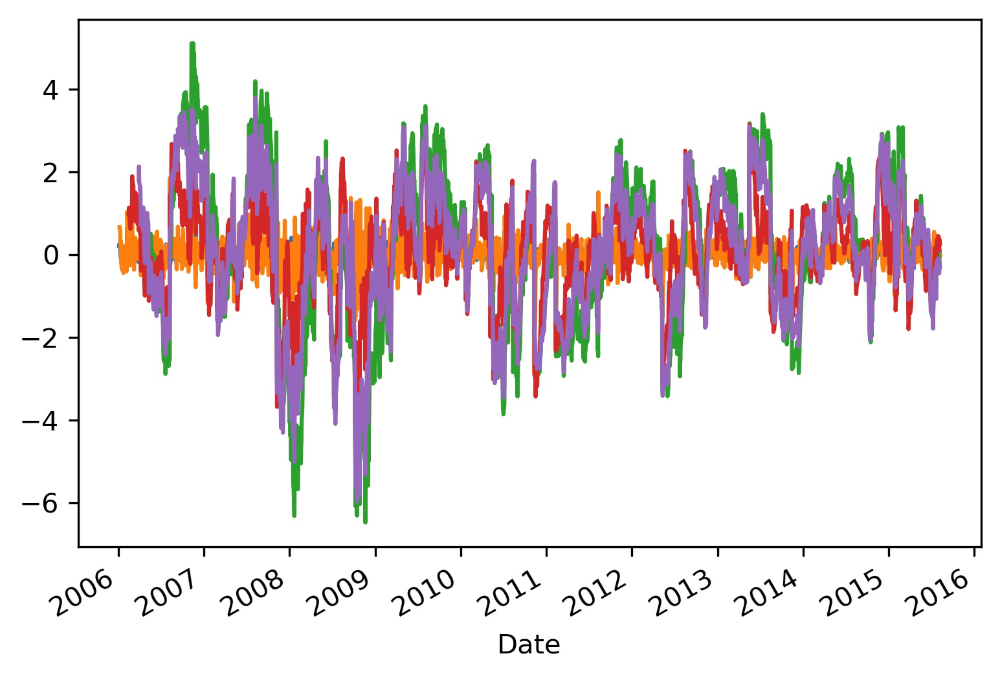

# Overview
This project uses Time Series Analysis and Time Series Modeling to accurately predict the current/future stock price of pre-selected companies. The purpose for this time series model is so that we can advise our investors when to put their money into the market.

We will be focusing on data collected from January 2006 until January 2018. This dataset is consistent of entries when the stock market is open


# Business Understanding & Key Questions
The ever wanting answer to everyone who wants to turn their money into more money is when is the right time to invest my money into the stock market. Timing is crucial when it comes to stocks and investing. Putting in your money when the market is reaching a peak and will only go down could cost you your life savings. Taking your money out too early could make you miss out on capital gains that could finance the start of a new journey. You as a future investor could possibly use our model to find out the future price of a stock.  


* Is it possible to predict future stock prices by just looking at the past?
* How significant is looking at the closing price for a stock for the day play into the future price?
* Is it the right time to invest?
# Behind Our Data Decisions
The following dataset was grabbed from kaggle and was used to build our model. It contains around 3000 rows with information such as date, high, low, open, close, volume & name. The dataset was already clean with no null values or any outliers.
* DJIA_equities/CSCO_2006-01-01_to_2018-01-01.csv


When thinking about time series, the first objective of the modeling process is to have a data set that is fully cleaned meaning there aren’t any null/NaN values and that the features that are left in our data frame are only values we plan on fully utilizing for processing. With our dataset, we were fortunately given the following: 
* opening 
* closing 
* low 
* high 
* ticker 
* volume 

For each of the 30 constituents that make up the Dow Jones Index. For the sake of our predictions, we wanted to use the closing price which is a strong indicator for the following days as it is reflective of all news what occurred that day, and can also be indicative of the opening price the following day given market conditions. If the close is higher than the prior open or prior day close, it generally will mean a strong market indicator that the price will continue to run given some string of good news around the equity. An example of this would be a company reporting strong earnings as of a prior quarter or announcing a new product such as a new range of iPhone for Apple. 

To drill down the data a bit further, we decided to focus specifically on one equity, CSCO or formally known as Cisco Systems, Inc. Cisco is a multinational company conglomerate that develops and sells software, hardware and other high end technology systems. CSCO historically has fluctuated around 20-30 dollars in the mid 200s and early 2010s however they’ve seen a steady increase in the last 5 years 2016-2022 to a price around 60 dollars now. We decided this would be a good data set to use as it was somewhat stationary already however it would test our time series prowess to see if we could predict data we split from around 2016-2018.

# Modeling

As mentioned above, our modeling process first started with a baseline model that we created quickly to be able to test our model against an extremely simple model. This model, in the time series world, is called the naive model, given that it is something that predicts tomorrow’s value based on the prior day’s result.

To do this, we shifted our data one day forward and compared that against the actual results. From the graph below, you can see that this model funnily enough performs extremely well. This can be attributed to not very large changes in the stock price day over day as well as well as low volatility in the market. 


The average RMSE for this model was around $0.41 which while is not that far off in the grand scheme of things, for a stock price it’s incredibly awful. This would result in buying or selling at some indicator 0.41c off which means a losing trade of 0.41c per how many shares bought. The following graph shows the naive model’s average errors layered below the rolling standard deviation over 30 days. This helps show that this model is relatively stationary as it is, however definitely needs some love given the model really struggles in times where there is high volatility or unexpected events. This is extremely evident in 2008 with the financial crisis and days where nobody expected the housing crisis to occur.


Knowing that this model wasn’t residual by the two above graphs, we started looking into various different methods of making time series data stationary such as differencing, rolling averages and square rooting the data. We ran Dickey Fuller tests on each different data set after trying some de-trending in the data and found that a rolling average of 1 day gave us the best result where our test statistic was smaller than the critical value, therefor meaning we could reject the null hypothesis.

Before moving on, it’s certainly important we state our null and alternative hypothesizes below.
	Null: The dataset is not stationary.
	Alternative: The dataset is stationary.

You can see by the graph that our model slowly creeps into a much more closely aligned or linear model that accounts for trends thru out the CSCO price change over 12 years. The orange, despite being a bit hard to see, does the best job of representing stationary data and ultimately allows us to begin modeling.

Results:

 The test statistic is: -36.89467794577721
 
 The critical value when alpha is 5% is: -2.862739030792749




We then moved on to an ARIMA model trying to determine what the best p and q values were knowing what our b value (which is used for differencing), would be 1 given the results earlier on.

Interestingly enough, our first model no matter what we changed our values to for p and q created a straight line across the different data points. The RMSE was around $2.71 which is certainly abysmal if we were to take this to the market for actual trading.

One thing that I found extremely interesting is that it didn’t account for any of the prior dips or rises in price, even if we were able to tweak the AR (autoregression) which helps account for prior day moves and MA (moving average) numbers. It seemed that whatever we used, it created a linear answer despite not what we wanted.

One possibility of this problem could have been created by trying to predict roughly 600 days of data, so we tweaked the model to try and predict 50 days of data. To our demise and downfall, the model seemed the exact same. A much different linear line across a valley of data points between two outliers.


# Recommendations & Conclusions
Through exhausted data exploration and model creations we deem that our dataset and the capabilities of time series modeling on its own to not be a good way to accurately predict the future price of stocks. With our best predicting model having a mean square error of ($0.42) it gives way too much uncertainty on the future price of the stock. Using our model could lead to investors putting in money into the market at the wrong times and have them lose their instant deposits. With this in mind our model hammers down that predicting stock prices is far from an easy task to accomplish and we recommend to not use this model and to look for other model creations to attempt to predict stock prices. For future analysis we would want to optimize more and test more data against additional weeks. We could also look into other Neural Network models such as Long Short Term Memory Recurrent Neural Network (LSTM).

# External Links
[Presentation](https://docs.google.com/presentation/d/1wXTgnIg2QwhYDieBWDIVPHNKBEn_snRSnzts5Syo9Ss/edit#slide=id.gd251bb473_0_600)

[Data Source](https://www.kaggle.com/szrlee/stock-time-series-20050101-to-20171231)

[Jupyter Notebook](./WallstreetCollects_FINAL.ipynb)

## Repository Structure
```
├── README.md                           <- The top-level README for reviewers of this project
├── WallstreetCollects_FINAL.ipynb      <- Narrative documentation of analysis in Jupyter notebook
├── WSC_powerpoint.pdf     		<- PDF version of project presentation
├── EDA_Notebooks                       <- Our individual notebooks
├── DJIA_equities                       <- Both sourced externally and generated from code
└── Images                              <- Both sourced externally and generated from code
